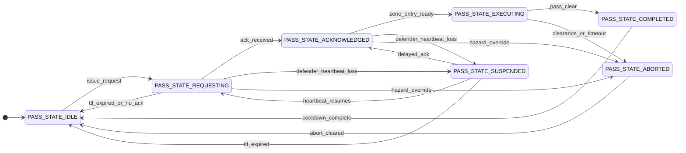
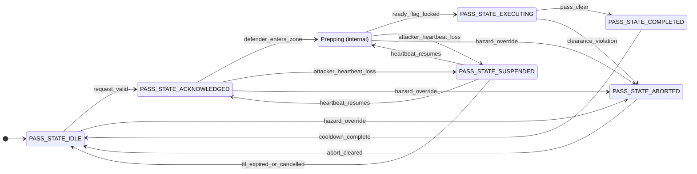

# Laguna Seca Multicar Rules of Engagement
The goal is to exercise multi-car passing where every vehicle runs active cruise control and follows negotiated speed profiles without race control intervention.

## Summary of the Rules
- Passing is allowed only on certified straights that provide enough lateral clearance for both cars to hold their lanes.
- The attacker broadcasts `PASS_STATE_REQUESTING` in `pass_state` before entering a pass zone, including its own ID, the defender ID, and the requested zone ID.
- The defender must reply with `PASS_STATE_ACKNOWLEDGED` in `pass_state` before the maneuver starts; until then both cars remain in formation and the attacker uses cruise control to manage spacing.
- After acknowledgment, the attacker and defender may stage for the pass: maintain nominal speed; lane positioning isn’t required until the straight. At the entry to the authorized passing zone, the defender drops to the negotiated yield speed and the attacker moves to the designated passing lane.
- Outside authorized zones, vehicles may change lanes to set up the maneuver but must maintain nominal speed and spacing until they enter a passing zone or receive a race control directive.
- Both cars emit `PASS_STATE_COMPLETED` once the attacker is safely ahead so nominal formation rules resume.
- **If any vehicle broadcasts `STATE_EMERGENCY_STOP`, every car within radio reach must come to an immediate stop until that state is clear.**[^race-control]

## AVLT coordination message
```Python
std_msgs/Header header        # Standard ROS header (stamp drives relative timing)

uint8   car_id                # Vehicle ID [ - ]
uint8   state                 # Vehicle state enum below
uint8   heartbeat             # Rolling heartbeat counter; drop rate exposes link quality [ - ]

int32   lat_e7                # Latitude * 1e7, rear-axle centre [ signed deg * 1e7 ]
int32   lon_e7                # Longitude * 1e7, rear-axle centre [ signed deg * 1e7 ]
int16   alt_dm                # Altitude (ellipsoid) in decimetres [ dm ]
int16   heading_cdeg          # Heading in centi-degrees, North = 0 [ deg * 100 ]
int16   vel_cms               # Longitudinal speed in centimetres per second [ cm/s ]

uint8   pass_state            # Engagement finite-state machine value [ enum below ]
uint8   pass_sequence         # Monotonic counter to correlate handshakes
uint8   target_car_id         # Defender car ID being overtaken or followed [ - ]
uint8   pass_zone_id          # Identifier for the authorized straight where the pass occurs
uint16  yield_speed_cms       # Defender follow speed for yielding car [ cm/s ]
uint16  request_ttl_ms        # Request time-to-live relative to header.stamp [ ms ]

# Vehicle state constants
uint8 STATE_UNKNOWN = 0
uint8 STATE_EMERGENCY_STOP = 1
uint8 STATE_CONTROLLED_STOP = 2
uint8 STATE_NOMINAL = 3

# Pass state constants
uint8 PASS_STATE_IDLE = 0
uint8 PASS_STATE_REQUESTING = 1
uint8 PASS_STATE_ACKNOWLEDGED = 2
uint8 PASS_STATE_PREPPING = 3
uint8 PASS_STATE_EXECUTING = 4
uint8 PASS_STATE_COMPLETED = 5
uint8 PASS_STATE_ABORTED = 6
uint8 PASS_STATE_SUSPENDED = 7
```

### Field guidance
- `car_id`/`state` identify the publishing vehicle and communicate whether it is nominal, while `heartbeat` reuses the AVLT counter so peers infer link quality from missed increments.
- `lat_e7`/`lon_e7`/`alt_dm`/`heading_cdeg`/`vel_cms` retain ~1 cm horizontal resolution worldwide, ~0.1 m altitude resolution, and 0.01°/0.01 m/s orientation and speed resolution with compact integer storage.
- `pass_state` carries the FSM value using `PASS_STATE_*` constants so planners pin to the correct engagement mode, including abort behaviour defined in lane metadata.
- `pass_sequence` increments whenever a fresh pass is requested so acknowledgements and completions match even if packets drop.
- `target_car_id`/`pass_zone_id` bind the requester to a specific defender and certified straight defined in the track configuration table, which encodes lane boundaries, speed profiles, clearance envelopes, and abort plans without altering message semantics.
- `yield_speed_cms` stores the negotiated follow speed with centimetre-per-second resolution so both controllers hold the same target once yield mode begins.
- `request_ttl_ms` is applied against `header.stamp`; receivers compute `deadline = header.stamp + request_ttl_ms` and revert to `PASS_STATE_IDLE` after that time.

### Autonomous multi-car state machine
Each vehicle runs the same finite-state machine keyed by `pass_state`. The attacker is the car that issued the current request, and the defender is the `target_car_id`. The FSM governs overtaking, yielding, and formation behaviour without manual input and scales to multiple competitors through zone reservations and queued requests.

#### Attacker state diagram


#### Defender state diagram


#### State semantics
- `PASS_STATE_IDLE`: No active request; vehicles maintain nominal race pace and formation spacing.
- `PASS_STATE_REQUESTING`: Attacker has advertised a pass and awaits acknowledgement while both cars hold formation at nominal speed.
- `PASS_STATE_ACKNOWLEDGED`: Request matched with acknowledgement; the zone is reserved and both cars stay staged at nominal speed until the defender reaches the zone entry.
- `PASS_STATE_EXECUTING`: The defender is inside the zone on the on the defender line, attacker vehicle may now overtake.
- `PASS_STATE_COMPLETED`: Attacker achieved the required gap, both cars broadcast completion, and formation logic prepares to return to idle after cool-down.
- `PASS_STATE_ABORTED`: Hazard, rule break, or override forced the abort profile; cars remain in-lane under the abort plan until cleared.
- `PASS_STATE_SUSPENDED`: Communication degraded but TTL remains valid; cars pause progression and hold formation while connectivity is restored.

#### Attacker transitions
| From | Event / Guard | To | Action |
| --- | --- | --- | --- |
| Idle | Faster attacker identifies eligible pass zone, attacker self state is `STATE_NOMINAL`, and found no conflicting reservation | Requesting | Populate `target_car_id`, `pass_zone_id`, `yield_speed_cms`, `request_ttl_ms`, increment `pass_sequence`, broadcast request. |
| Requesting | TTL expires or defender remains in `PASS_STATE_IDLE` | Idle | Clear defender metadata, observe cool-down before reissuing. |
| Requesting | Matching `PASS_STATE_ACKNOWLEDGED` received | Acknowledged | Reserve zone, synchronise approach speed, rebroadcast state. |
| Requesting | Defender heartbeat lost before acknowledgement | Suspended | Hold staging lane at nominal speed, continue transmitting request until reconnection or timeout. |
| Requesting | Hazard, rule violation, or race-control override detected | Aborted | Broadcast `PASS_STATE_ABORTED`, follow abort profile in-lane. |
| Acknowledged | Attacker reaches zone entry with defender ready metadata present | Executing | The defender has sent executing, and attacker has pass the zone entry. |
| Acknowledged | Hazard, rule violation, or race-control override detected | Aborted | Broadcast `PASS_STATE_ABORTED`, follow abort profile. |
| Acknowledged | Defender heartbeat lost before entry | Suspended | Freeze approach, continue publishing acknowledgement metadata until connectivity returns. |
| Executing | Clear-ahead criteria satisfied before zone exit | Completed | Broadcast `PASS_STATE_COMPLETED`, release zone reservation. |
| Executing | Clearance violation, defender downgrade, emergency stop, or heartbeat timeout | Aborted | Follow abort profile while maintaining assigned lanes. |
| Completed | Cool-down interval elapsed and spacing restored | Idle | Reset metadata; ready for fresh request. |
| Suspended | Heartbeat resumes before TTL expiry and no acknowledgement yet | Requesting | Refresh `request_ttl_ms`, reissue request, maintain staging lane. |
| Suspended | Delayed `PASS_STATE_ACKNOWLEDGED` received | Acknowledged | Restore staging posture and continue approach. |
| Suspended | TTL expires without reconnection | Idle | Clear reservation; next attempt must increment `pass_sequence`. |
| Aborted | Abort profile complete and race control clears | Idle | Reset metadata and increment `pass_sequence` for future requests. |


#### Defender transitions
| From | Event / Guard | To | Action |
| --- | --- | --- | --- |
| Idle | Valid request targeting defender, zone matches, defender `STATE_NOMINAL`, no higher-priority constraint, not already defending. Not trailing another vehicle. | Acknowledged | Broadcast `PASS_STATE_ACKNOWLEDGED`, reserve zone, begin staging.|
| Idle | Hazard, emergency stop, or lane-integrity concern | Aborted | Broadcast `PASS_STATE_ABORTED`, hold lane at abort profile while awaiting clearance. |
| Acknowledged | Defender enters the zone entry | Prepping | Reduce to `yield_speed_cms`, and lock into the defender Line
| Acknowledged | Hazard prior to zone entry | Aborted | Broadcast `PASS_STATE_ABORTED`, hold lane and follow abort profile. |
| Acknowledged | Attacker heartbeat lost before entry | Suspended | Maintain current lane and nominal speed, rebroadcast acknowledgement metadata until expiry. |
| Prepping | Locked into the defender line, reduced to `yield_speed_cms` (ready-flag) | Executing | Lock into defender line, reduce to `yield_speed_cms`, maintain lane discipline. |
| Prepping | Lost attacker hearbeast | Suspended | Freeze aproach, continue publishing prepping state until connectivity returns |
| Executing | `PASS_STATE_COMPLETED` received and trailing gap safe | Completed | Re-accelerate to race pace, release reservation, return to formation. |
| Executing | Clearance violation, hazard, or vehicle-state downgrade | Aborted | Follow abort profile in defender lane until cleared. |
| Suspended | Heartbeat resumes before TTL expiry | Acknowledged | Resume staging with latest metadata. |
| Suspended | TTL expires or race control cancels engagement | Idle | Release reservation, revert to formation mode. |
| Suspended | Heartbeat resumes | Prepping | Continue staging with latest metadata. |
| Any | Race-control override or emergency stop | Aborted | Enforce abort profile and await clearance. |
| Aborted | Abort profile complete and clearance granted | Idle | Reset metadata; ready to evaluate future requests. |


#### Multi-vehicle constraints
- Zone reservation: Only one engagement per `pass_zone_id` at a time; the first pair to reach `PASS_STATE_ACKNOWLEDGED` holds the lock.
- Queueing: Each vehicle queues incoming requests by distance-to-zone and sequence number; only the queue head may grant acknowledgement.
- Mutual exclusion: A vehicle cannot attack and defend in overlapping zones. If already defending while executing a pass, it declines new requests to avoid cascading manoeuvres.
- Minimum spacing: Before issuing a request the attacker ensures any third vehicle between attacker and defender is at least one car length outside the zone to avoid three-wide conflicts.
- Zone certification: Race control distributes pass-zone metadata tagged with supported vehicle combinations; only zones with adequate clearance may be requested.
- Zone discipline: Pass engagements restrict yield-speed profiles to the configured zone boundaries; lane changes are allowed outside the zone provided they respect spacing, signalling, and track rules.
- Heartbeat-aware queuing: If a car stops transmitting heartbeat messages, pending requests referencing it stay on hold until heartbeats resume. Requests expiring before then must be resubmitted.
- Global abort propagation: Any `PASS_STATE_ABORTED` announcement for a zone forces all vehicles advertising that zone to drop to `PASS_STATE_IDLE` and re-evaluate.
- Abort lane discipline: Pass-zone configurations define the abort profile and lane assignments; all nearby vehicles hold their current lanes (attacker in the passing lane, defender in the defender lane) until the zone clears.
- Cool-down enforcement: After a completion or abort both participants stay in `PASS_STATE_IDLE` for the shared cool-down window so trailing vehicles get a deterministic opportunity to request the next pass.

### Emergency stop coordination
- Emergency stops trigger only on a transition into `STATE_EMERGENCY_STOP`; each listener latches the initiating `car_id` and message `header.stamp` as the stop event.
- Vehicles remain stopped until they receive a newer message from that initiator reporting a non-emergency state, or an explicit clear directive.
- Messages that repeat the same stop event after the clear are ignored so delayed packets do not cause phantom stops.

### Abort handling
- Every `pass_zone_id` carries a fail-safe abort profile and lane assignments so standard lane-keeping suffices.
- When `PASS_STATE_ABORTED` is announced, both cars brake toward the abort target within 100 ms while holding their lanes if they are already inside the active pass zone; otherwise they maintain their current lanes at nominal speed until race control issues further instructions.
- Trailing cars entering the zone after an abort message maintain their lanes and match the slowest vehicle ahead, blocking new passes until the zone clears.
- Participants exchange `PASS_STATE_IDLE` messages with a re-entry flag once telemetry stabilises, then accelerate back to race pace while maintaining lane discipline.
- If connectivity stays degraded, cars continue announcing `PASS_STATE_ABORTED` at least 5 Hz so observers know the zone remains restricted.

#### Autonomy guarantees
- Transitions rely only on telemetry, planner outputs, and the AVLT coordination message; no manual operator input is needed once the race starts.
- Race control overrides (`STATE_CONTROLLED_STOP`[track red or vehicle red flag] or `STATE_EMERGENCY_STOP`[purple flag]) force an immediate move to `PASS_STATE_ABORTED`.
- Connectivity-aware policies ensure cars falling outside the ~X m V2V envelope pause the manoeuvre in `PASS_STATE_SUSPENDED` or abort if reconnection misses the timeout, preventing blind passes.
- Formal verification should confirm every path completes or aborts with a deterministic resolution so more than two cars cannot livelock in the same zone.

[^race-control]: The safe-pass flow assumes an active human race control monitoring the event. Race control must be prepared to halt the field if the transponder system fails and to red-stop trailing cars when a leading transpondered vehicle leaves the track or stops unexpectedly. Teams should evaluate additional edge cases and recognise the system's limitations; they may run their own perception stacks, but cannot assume that other entrants do so. Participation requires a working ACC that respects the transponder-provided distances.
