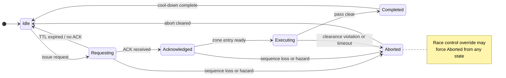
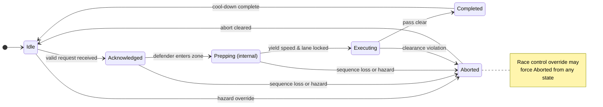

# Multicar Rules of Engagement

| | |
|---|---|
| **Version** | 0.1.0 |
| **Date** | 2026-03-09 |
| **Status** | Draft |

> **Phase 0 -- 2-Vehicle Bare Bones**
> This document describes the Phase 0 implementation scope. Only **two vehicles** are permitted on track at any time. The full passing handshake is required, but multi-vehicle coordination features (queueing, mutual exclusion, three-wide prevention) are deferred to later phases. See the [Roadmap](#roadmap) for what comes next.

## Overview

Two autonomous vehicles share a track during a race or supervised practice session. Before one vehicle (the **attacker**) can overtake the other (the **defender**), they must complete a radio handshake: the attacker asks permission, the defender acknowledges, and both follow pre-agreed speed and lane rules through a designated **pass zone**. If anything goes wrong -- lost radio contact, a hazard, or a race-control directive -- both vehicles fall back to safe, predictable behaviour (abort) without any human-in-the-loop input. This document specifies the messages, state machine, and rules that make that handshake work.

## Quick-start: happy-path pass sequence

> A normal, successful pass from start to finish in six steps.

1. **Attacker broadcasts `PASS_STATE_REQUESTING`** -- includes its own `vehicle_number`, the defender's `target_vehicle_number`, the chosen `pass_zone_id`, a `yield_speed`, and a `request_ttl_ms` deadline.
2. **Defender replies `PASS_STATE_ACKNOWLEDGED`** -- confirms it will yield. Both vehicles hold formation speed while approaching the pass zone.
3. **Defender enters the pass zone and drops to `yield_speed`** -- transitions through `PASS_STATE_PREPPING` internally, then broadcasts `PASS_STATE_EXECUTING` once locked into the defender lane.
4. **Attacker enters the pass zone and overtakes** -- seeing the defender in `PASS_STATE_EXECUTING`, the attacker moves to the passing lane and completes the overtake.
5. **Both broadcast `PASS_STATE_COMPLETED`** -- the attacker is safely ahead and the required gap is met.
6. **Cool-down elapses, both return to `PASS_STATE_IDLE`** -- formation rules resume; a new pass may be requested after the cool-down window (`transponder.cooldown_time_to_live_ms`, default 2000 ms).

If any step fails (timeout, lost sequence, hazard), the FSM moves to `PASS_STATE_ABORTED` -- see [Abort handling](#abort-handling) and [State semantics](#state-semantics).

> **Safety override:** If any vehicle broadcasts `STATE_EMERGENCY_STOP`, every car within radio reach must come to an immediate stop until that state is clear.[^race-control]

## AVLT Position message
```Python
builtin_interfaces/Time stamp  # Message timestamp; drives relative timing [ s + ns ]
uint8   vehicle_number        # Vehicle number [ - ]
uint8   sequence_number       # Rolling sequence counter; drop rate exposes link quality [ - ]

float64 lat             # Vehicle latitude, centre of rear axle [ dd.dd ]
float64 lon             # Vehicle longitude, centre of rear axle [ dd.dd ]
float32 alt             # Vehicle altitude (ellipsoid), centre of rear axle [ m ]
float32 heading         # Vehicle heading, GPS style, North = 0, East = 90 [ deg ]
float32 vel             # Vehicle speed, Vx_body [ m/s ]
uint8   state           # Vehicle state, see constants below [ - ]

# Vehicle state constants
uint8 STATE_UNKNOWN = 0
uint8 STATE_EMERGENCY_STOP = 1
uint8 STATE_CONTROLLED_STOP = 2
uint8 STATE_NOMINAL = 3
```

## AVLT Coordination message
```Python
builtin_interfaces/Time stamp  # Message timestamp; drives relative timing [ s + ns ]
uint8   vehicle_number        # Vehicle number [ - ]

uint8   pass_state            # Engagement finite-state machine value [ enum below ]
uint8   pass_sequence         # Monotonic counter to correlate handshakes
uint8   target_vehicle_number  # Defender vehicle number being overtaken or followed [ - ]
uint8   pass_zone_id          # Identifier for the authorized straight where the pass occurs
float32  yield_speed       # Defender follow speed for yielding car [ m/s ]
uint16  request_ttl_ms        # Request time-to-live relative to stamp [ ms ]

# Pass state constants
uint8 PASS_STATE_IDLE = 0
uint8 PASS_STATE_REQUESTING = 1
uint8 PASS_STATE_ACKNOWLEDGED = 2
uint8 PASS_STATE_PREPPING = 3
uint8 PASS_STATE_EXECUTING = 4
uint8 PASS_STATE_COMPLETED = 5
uint8 PASS_STATE_ABORTED = 6
```

### Field guidance
- `vehicle_number`/`state` identify the publishing vehicle and communicate whether it is nominal, while `sequence_number` reuses the AVLT counter so peers infer link quality from missed increments.
- `lat`/`lon`/`alt`/`heading`/`vel` capture the sensed pose and longitudinal speed in floating-point units suitable for downstream autonomous driving software.
- `pass_state` carries the FSM value using `PASS_STATE_*` constants so each vehicle's autonomy stack knows which engagement mode is active and which abort behaviour applies.
  - **Defender-only state:** `PASS_STATE_PREPPING` is broadcast on the wire by the defender only, during the window between entering the zone and settling into the yield lane at `yield_speed`.
  - **Attacker perspective:** The attacker ignores `PASS_STATE_PREPPING`. From the attacker's view, the transition from acknowledged to executing happens when the defender's broadcast changes to `PASS_STATE_EXECUTING`.
- `pass_sequence` increments whenever a fresh pass is requested so acknowledgements and completions match even if packets drop.
- `target_vehicle_number`/`pass_zone_id` bind the requester to a specific defender and certified straight defined in the track configuration table, which encodes lane boundaries, speed profiles, clearance envelopes, and abort plans without altering message semantics.
- `yield_speed` stores the negotiated follow speed with meter-per-second resolution so both vehicles hold the same target once yield mode begins.
- `request_ttl_ms` is applied against `stamp`; receivers compute `deadline = stamp + request_ttl_ms` and revert to `PASS_STATE_IDLE` after that time. As a `uint16`, the maximum value is 65535 ms (~65 s), which is sufficient for Phase 0 pass engagements.

### Following behaviour (pre-pass)
When a faster vehicle (the prospective attacker) closes on a slower vehicle (the prospective defender), the following rules apply before any pass request is issued:

- **Free line choice:** The trailing vehicle may follow any racing line; it is not required to slot behind the defender's lane.
- **Speed matching:** Once within transponder range, the trailing vehicle matches the defender's speed as reported by the AVLT Position `vel` field.
- **Minimum following distance:** The trailing vehicle maintains at least a configurable minimum gap (e.g., `transponder.min_following_distance_m`) behind the defender. The gap is measured longitudinally along the track centreline using both vehicles' transponder positions.
- **No overtaking outside a pass zone:** The trailing vehicle must not move ahead of the defender until a full pass handshake has been completed and both vehicles are inside an authorized pass zone.
- **Transition to requesting:** When the trailing vehicle determines it is faster and an eligible pass zone is ahead, it may issue `PASS_STATE_REQUESTING`. Until the defender acknowledges, both vehicles continue following these rules.

### Autonomous pass state machine
Each vehicle runs the same finite-state machine keyed by `pass_state`. The attacker is the car that issued the current request, and the defender is the `target_vehicle_number`. The FSM governs overtaking, yielding, and formation behaviour without manual input. In Phase 0 the FSM handles a single attacker-defender pair; later phases scale to multiple competitors through zone reservations and queued requests.

#### Attacker state diagram


#### Defender state diagram


#### State semantics
- `PASS_STATE_IDLE`: No active request; vehicles maintain nominal race/supervised practice pace and keep a safe following distance.
- `PASS_STATE_REQUESTING`: Attacker has advertised a pass and awaits acknowledgement while both cars hold their current positions at nominal speed.
- `PASS_STATE_ACKNOWLEDGED`: Request matched with acknowledgement; the zone is reserved and both cars continue at nominal speed until the defender reaches the zone entry.
- `PASS_STATE_EXECUTING`: The defender is inside the zone on the defender line, attacker vehicle may now overtake.
- `PASS_STATE_COMPLETED`: Attacker achieved the required gap, both cars broadcast completion, and prepare to return to idle after the cool-down window.
- `PASS_STATE_ABORTED`: Hazard, rule break, sequence loss, or override forced the abort profile; cars remain in-lane under the abort plan until cleared.

#### Attacker transitions
| From | Event / Guard | To | Action |
| --- | --- | --- | --- |
| Idle | Faster attacker identifies eligible pass zone, attacker self state is `STATE_NOMINAL`, and found no conflicting reservation | Requesting | Populate `target_vehicle_number`, `pass_zone_id`, `yield_speed`, `request_ttl_ms`, increment `pass_sequence`, broadcast request. |
| Requesting | TTL expires or defender remains in `PASS_STATE_IDLE` | Idle | Clear defender metadata, observe cool-down before reissuing. |
| Requesting | Matching `PASS_STATE_ACKNOWLEDGED` received | Acknowledged | Reserve zone, synchronise approach speed, rebroadcast state. |
| Requesting | Defender sequence lost, hazard, rule violation, or race-control override | Aborted | Broadcast `PASS_STATE_ABORTED`, follow abort profile in-lane. |
| Acknowledged | Attacker reaches zone entry with defender ready metadata present | Executing | The defender has sent executing, and attacker has passed the zone entry. |
| Acknowledged | Defender sequence lost, hazard, rule violation, or race-control override | Aborted | Broadcast `PASS_STATE_ABORTED`, follow abort profile. |
| Executing | Clear-ahead criteria satisfied before zone exit | Completed | Broadcast `PASS_STATE_COMPLETED`, release zone reservation. |
| Executing | Clearance violation, defender downgrade, emergency stop, or sequence timeout | Aborted | Follow abort profile while maintaining assigned lanes. |
| Completed | Cool-down interval elapsed and spacing restored | Idle | Reset metadata; ready for fresh request. |
| Aborted | Abort profile complete and race control clears | Idle | Reset metadata and increment `pass_sequence` for future requests. |


#### Defender transitions
| From | Event / Guard | To | Action |
| --- | --- | --- | --- |
| Idle | Valid request targeting defender, zone matches, defender `STATE_NOMINAL`, no higher-priority constraint, not already defending. Not trailing another vehicle. | Acknowledged | Broadcast `PASS_STATE_ACKNOWLEDGED`, reserve zone, begin staging.|
| Idle | Hazard, emergency stop, or lane-integrity concern | Aborted | Broadcast `PASS_STATE_ABORTED`, hold lane at abort profile while awaiting clearance. |
| Acknowledged | Defender enters the zone entry | Prepping | Reduce to `yield_speed`, and lock into the defender line. |
| Acknowledged | Attacker sequence lost, hazard, or race-control override prior to zone entry | Aborted | Broadcast `PASS_STATE_ABORTED`, hold lane and follow abort profile. |
| Prepping | Locked into the defender lane and reduced to `yield_speed` | Executing | Hold defender lane at `yield_speed`, maintain lane discipline. |
| Prepping | Lost attacker sequence, hazard, or race-control override | Aborted | Broadcast `PASS_STATE_ABORTED`, hold defender lane and follow abort profile. |
| Executing | `PASS_STATE_COMPLETED` received and trailing gap safe | Completed | Re-accelerate to race/supervised practice pace, release reservation, return to formation. |
| Executing | Clearance violation, hazard, or vehicle-state downgrade | Aborted | Follow abort profile in defender lane until cleared. |
| Any | Race-control override or emergency stop | Aborted | Enforce abort profile and await clearance. |
| Aborted | Abort profile complete and clearance granted | Idle | Reset metadata; ready to evaluate future requests. |


### Two-vehicle constraints (Phase 0)
With only two cars on track, several N-vehicle concerns (queueing, mutual exclusion, three-wide prevention) do not apply. The constraints below are the subset enforced in Phase 0.

- Zone reservation: Only one engagement per `pass_zone_id` at a time. With two vehicles this is trivially satisfied -- the single pair either holds the reservation or does not.
- Zone certification: Pass-zone metadata defines supported clearance envelopes; only zones with adequate lateral clearance may be requested.
- Zone discipline: Yield-speed profiles are restricted to the configured zone boundaries; lane changes are allowed outside the zone provided they respect spacing and track rules.
- Sequence awareness: If a car stops incrementing its `sequence_number`, any active engagement is aborted (`PASS_STATE_ABORTED`). A new request must be issued after cool-down once sequence updates resume.
- Abort lane discipline: Pass-zone configurations define the abort profile and lane assignments; both vehicles hold their current lanes (attacker in the passing lane, defender in the defender lane) until the zone clears.
- Cool-down enforcement: After a completion or abort, both participants stay in `PASS_STATE_IDLE` for the shared cool-down window (configured via `transponder.cooldown_time_to_live_ms`, default 2000 ms) before a new pass may be requested.
- Simultaneous requests: If both vehicles issue `PASS_STATE_REQUESTING` targeting each other in the same cycle, the vehicle with the lower `vehicle_number` wins and the other reverts to `PASS_STATE_IDLE`. This deterministic tie-break prevents deadlock without requiring additional negotiation.

### Pit lane considerations (Phase 0)

#### Filtering pit-lane vehicles from on-track passing logic
- On-track vehicles use geofence filtering to determine whether a transponder report originates from a car on the active racing surface or in the pit lane.
- Transponder reports from vehicles whose position falls within the pit lane geofence are excluded from passing logic. The on-track vehicle treats them as non-participants for coordination purposes.
- No state change is required from pit-lane vehicles; position-based filtering is sufficient for Phase 0.

#### Entering pit lane
- Before reaching the pit entrance, the vehicle broadcasts pit intent via the coordination message (see [Simultaneous pit entry protocol](#simultaneous-pit-entry-protocol)) so the other vehicle can react early.
- When the vehicle transitions onto the pit trajectory (pit entry), any active pass engagement must be aborted (`PASS_STATE_ABORTED`) before entering pit road.
- Once on the pit trajectory, the vehicle reverts to `PASS_STATE_IDLE` and ceases publishing pass coordination messages. It continues publishing AVLT Position messages (including `lat`/`lon`/`vel`/`state`) so the other vehicle can track its pit lane position via geofence filtering.
- The vehicle respects pit lane speed limits and is excluded from the passing protocol while in pit.

#### Leaving pit lane
- The vehicle must be in `PASS_STATE_IDLE` before exiting pit lane onto the racing surface.
- After pit exit, the vehicle resumes transponder coordination and may initiate or receive pass requests once it reaches a valid passing zone.
- A cool-down period applies after pit exit before the vehicle may issue a pass request, preventing immediate engagement while merging onto the racing surface.
- If the on-track vehicle is approaching the pit exit zone while the pitting vehicle is merging out, the on-track vehicle has right-of-way. The pitting vehicle does not merge onto the racing surface until the on-track vehicle's transponder position has cleared the pit exit region.

#### Simultaneous pit entry protocol
When both vehicles intend to pit at the same time, a formal spacing protocol prevents conflicts in pit road and pit lane.

**Pit intent signaling (belt-and-suspenders):**
- A vehicle intending to pit broadcasts a pit intent indicator via the coordination message.
  - **Phase 0 convention:** The vehicle sets `pass_zone_id` to a reserved pit-zone identifier (defined in the track configuration table, distinct from any on-track pass zone ID) while in `PASS_STATE_IDLE`.
  - **Receiver logic:** Receivers distinguish pit intent from normal idle by checking whether `pass_zone_id` is non-zero and matches a pit-zone entry in the configuration table.
  - **Phase 1 proposal:** A formal `pit_intent` field or `STATE_PITTING` vehicle state constant replaces this convention.
- In addition to the explicit announcement, the trailing vehicle validates pit intent by checking whether the lead vehicle's transponder position enters the pit entrance geofence region.
- Both signals must agree for the trailing vehicle to enter pit spacing mode. If the lead announces pit intent but its position does not enter the pit entrance geofence within a configurable timeout, the trailing vehicle ignores the announcement and resumes normal behavior.

**Safe following distance in pit lane:**
- When both vehicles are pitting, the trailing vehicle maintains a configurable minimum gap (e.g., 2 car lengths) behind the lead vehicle throughout the entire pit road and pit lane.
- The trailing vehicle reduces to pit lane speed and uses its longitudinal control to hold the gap behind the lead.
- The minimum gap applies from pit road entry through pit lane until the lead vehicle reaches its pit box and the trailing vehicle passes it or reaches its own box.
- If the trailing vehicle's pit box is before the lead vehicle's pit box, normal pit lane behavior applies -- the trailing vehicle peels off into its box first.

**Priority and ordering:**
- The vehicle closer to the pit entrance (i.e., ahead on track) has priority to enter pit road first.
- The trailing vehicle must not attempt to overtake in pit road or pit lane under any circumstances. Pit lane is single-file, no passing.
- If the trailing vehicle reaches the pit entrance before the lead has cleared a safe distance, the trailing vehicle holds at the pit entrance boundary at pit crawl speed until the minimum gap is established.

**Abort / cancel:**
- If a vehicle that announced pit intent cancels (e.g., returns to the racing line before entering the pit entrance geofence), the trailing vehicle exits pit spacing mode and resumes normal on-track behavior.
- Any active on-track pass engagement must be aborted (`PASS_STATE_ABORTED`) before either vehicle enters pit road (see [Entering pit lane](#entering-pit-lane)).

### Emergency stop coordination
- Emergency stops trigger only on a transition into `STATE_EMERGENCY_STOP`; each listener latches the initiating `vehicle_number` and message `stamp` as the stop event.
- Vehicles remain stopped until they receive a newer message from that initiator reporting a non-emergency state, or an explicit clear directive.
- Messages that repeat the same stop event after the clear are ignored so delayed packets do not cause phantom stops.

### Abort handling
- Every `pass_zone_id` carries a fail-safe abort profile and lane assignments so standard lane-keeping suffices.
- When `PASS_STATE_ABORTED` is announced, both cars brake toward the abort target within 100 ms while holding their lanes if they are already inside the active pass zone; otherwise they maintain their current lanes at nominal speed until race control issues further instructions.
- If the other vehicle enters the zone after an abort message, it maintains its lane and matches the speed of the vehicle ahead, blocking new passes until the zone clears.
- Participants exchange `PASS_STATE_IDLE` messages once telemetry stabilises, then accelerate back to race/supervised practice pace while maintaining lane discipline.
- If connectivity stays degraded, cars continue announcing `PASS_STATE_ABORTED` at least 5 Hz so observers know the zone remains restricted.

### Stationary bogie on track (Phase 0)
A bogie may stop on the racing surface (mechanical failure, spin, or crash) yet continue publishing `STATE_NOMINAL` because its software has not detected the fault. Phase 0 applies a conservative policy:

- If a rival vehicle's transponder reports `STATE_NOMINAL` but its reported `vel` remains below a configurable threshold (e.g., < 0.5 m/s) for a sustained period, the vehicle treats the situation as ambiguous.
- **The vehicle does NOT attempt to pass a stationary bogie.** It holds formation behind the stopped vehicle at a safe following distance and awaits race control intervention.
- If a pass was already in progress when the bogie became stationary, the vehicle broadcasts `PASS_STATE_ABORTED` and follows the abort profile.
- If the bogie is off the racing surface (position outside the track geofence) but still publishing, the geofence filter excludes it from coordination logic and the vehicle proceeds normally along its trajectory.
- Rationale: Without onboard perception to verify the bogie's actual state, passing a vehicle that claims nominal status but is not moving is unsafe. Perception-assisted state verification is deferred to Phase 1.

### Autonomy guarantees
- Transitions rely only on telemetry, onboard autonomy outputs, and the AVLT coordination message; no manual operator input is needed once the race/supervised practice starts.
- Race control overrides (`STATE_CONTROLLED_STOP`[track red or vehicle red flag] or `STATE_EMERGENCY_STOP`[purple flag]) force an immediate move to `PASS_STATE_ABORTED`.
- Connectivity-aware policies ensure cars falling outside the V2V envelope (range TBD, track-dependent) abort the manoeuvre (`PASS_STATE_ABORTED`), preventing blind passes.
- Formal verification should confirm every path completes or aborts with a deterministic resolution so neither vehicle can livelock in the same zone. Phase 2 extends this guarantee to N vehicles.

---

## Roadmap

### Phase 1: Robustness & Hardening
The next priority after Phase 0 is making the 2-vehicle system resilient to real-world communication and timing issues.

- Introduce `PASS_STATE_SUSPENDED` for graceful recovery from transient sequence loss (Phase 0 aborts on any sequence loss)
- Delayed acknowledgment handling and packet loss recovery
- Connectivity-aware state transitions (automatic suspend/resume based on link quality instead of immediate abort)
- Abort propagation validation between both vehicles
- Full cool-down enforcement with configurable timers
- Formal verification that every FSM path terminates in `IDLE` or `ABORTED`
- Stationary bogie detection with speed-threshold validation and configurable timeouts
- Perception-assisted state verification (cross-check transponder state against observed behaviour)
- Formal `pit_intent` field in AVLT Coordination message (or `STATE_PITTING` in Position message)
- Pit lane spacing enforcement with configurable gap parameters

### Phase 2: N-Vehicle Support (work in progress)
Phase 2 scales the system to three or more vehicles on track simultaneously. Details will be refined as Phase 1 matures.

- 3+ vehicles on track with concurrent pass engagements
- Zone reservation locking: first pair to reach `PASS_STATE_ACKNOWLEDGED` holds the lock; others queue
- Request queueing by distance-to-zone and `pass_sequence` number
- Mutual exclusion: a vehicle cannot attack and defend in overlapping zones
- Minimum spacing constraints and three-wide conflict prevention
- Zone-certified vehicle combinations (metadata tags per zone)
- Sequence-aware queueing across multiple peers
- Global abort propagation: any `PASS_STATE_ABORTED` for a zone forces all vehicles in that zone to `PASS_STATE_IDLE`

---

## Glossary

| Term | Definition |
| --- | --- |
| **Attacker** | The vehicle initiating a pass request (the overtaking car). |
| **Defender** | The vehicle being overtaken; it yields speed and lane within the pass zone. |
| **Bogie** | Any other vehicle detected via transponder, before roles are assigned. |
| **Pass zone** | A pre-certified straight section of track where overtaking is permitted. Defined in the track configuration table with lane boundaries, speed profiles, and abort plans. |
| **Geofence** | A geographic boundary (polygon or corridor) used to classify whether a vehicle is on the racing surface, in the pit lane, or off-track. |
| **TTL (Time-to-live)** | `request_ttl_ms` -- the deadline (relative to `stamp`) after which an unanswered pass request expires and the attacker reverts to idle. |
| **Cool-down** | A mandatory wait period after a pass completes or aborts before a new request may be issued. Configured via `transponder.cooldown_time_to_live_ms` (default 2000 ms). |
| **Sequence number** | A rolling counter (`sequence_number`) in the AVLT Position message. If the counter stops incrementing, peers assume the link is degraded and abort any active engagement. |
| **Yield speed** | The reduced speed the defender holds inside the pass zone so the attacker can safely overtake. Carried in the `yield_speed` field. |
| **Abort profile** | A per-zone set of rules (target speed, lane assignments) that both vehicles follow when a pass is aborted. |
| **Formation** | The default driving mode when no pass is active: vehicles maintain nominal speed and a safe following distance. |

---

[^race-control]: The safe-pass flow assumes an active human race control monitoring the race/supervised practice event. Race control must be prepared to halt the field if the transponder system fails and to red-stop trailing cars when a leading transpondered vehicle leaves the track or stops unexpectedly. Teams should evaluate additional edge cases and recognise the system's limitations; they may run their own perception stacks, but cannot assume that other entrants do so. Participation requires a working longitudinal control system that respects the transponder-provided distances.
